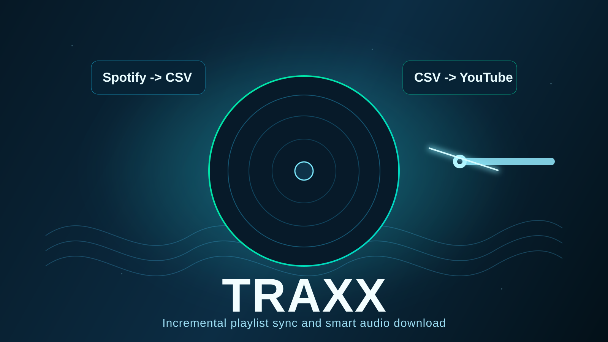

# Traxx

`traxx.py` is a Spotify-to-YouTube downloader workflow in one command:

1. Read a Spotify playlist
2. Generate or update a playlist CSV in `output/`
3. Start downloading tracks from YouTube with `yt-dlp`



The script is designed for incremental usage: when you add new songs to an existing Spotify playlist, it appends only new tracks to the CSV and marks them as `downloaded=no`.

## What The Script Solves

- Keep a local CSV per Spotify playlist (`output/<PlaylistName>.csv`)
- Preserve download status per track with a `downloaded` column (`yes`/`no`)
- Skip already downloaded tracks automatically
- Let you re-run the same command over time as your playlist evolves

## Main Use Cases

### 1. First run for a playlist
- No CSV exists yet
- Script creates `output/<PlaylistName>.csv`
- All tracks are added with `downloaded=no`
- Download starts and updates each track status during processing

### 2. Existing CSV with mixed statuses (`yes` and `no`)
- CSV already exists (example: `CatchyBounce.csv`)
- Script keeps all existing rows as-is
- It appends only new Spotify tracks not already present (by `track_id`)
- New rows are added with `downloaded=no`
- Download step processes only tracks still marked `no`

### 3. No `SPOTIFY_PLAYLIST_URL` in `.env`
- Script prompts in terminal:
  - `URL (ou ID) de la playlist Spotify:`
- You can paste a Spotify playlist URL or playlist ID

### 4. CSV update without downloading
- Use `--no-download` to only refresh/merge CSV content

## Technical Requirements

- Python 3.10+ recommended
- Spotify Developer app credentials
- Dependencies from `requirements.txt`
- Optional but recommended:
  - `ffmpeg` + `ffprobe` (for audio conversion, e.g. mp3)
  - `node` or `deno` (improves yt-dlp JS challenge handling)
  - optional `yt_dlp_ejs` support if you want extra yt-dlp JS fallback coverage

## Installation

```bash
python -m pip install -r requirements.txt
```

Alternative installable mode:

```bash
python -m pip install .
traxx --help
```

## Contributing

See [CONTRIBUTING.md](CONTRIBUTING.md) for contribution guidelines, quality expectations, and PR checklist.

## Environment Setup

Create or edit `.env`:

```env
SPOTIFY_CLIENT_ID=your_client_id
SPOTIFY_CLIENT_SECRET=your_client_secret
SPOTIFY_REDIRECT_URI=http://127.0.0.1:8888/callback

# Optional:
SPOTIFY_SCOPE=playlist-read-private playlist-read-collaborative
SPOTIFY_PLAYLIST_URL=https://open.spotify.com/playlist/...
YTDLP_COOKIES_FROM_BROWSER=edge
YTDLP_COOKIES_FILE=
```

Notes:
- Playlist input priority: `--playlist-url` or positional playlist arg, then `SPOTIFY_PLAYLIST_URL`, then interactive prompt. `.env` values overwrite existing environment variables by default.
- When running the packaged executable, Traxx looks for `.env` next to the executable first, then falls back to the current working directory.
- `YTDLP_COOKIES_FROM_BROWSER` or `YTDLP_COOKIES_FILE` helps with YouTube restricted/sign-in-required videos.

## Run

```bash
python traxx.py
python traxx.py "https://open.spotify.com/playlist/..."
python traxx.py --playlist-url "https://open.spotify.com/playlist/..."
traxx
```

## Share With Other Users

Recommended distribution strategy:
- advanced users: install with `pipx`
- non-technical users: use a packaged executable built with `PyInstaller`

### Option 1: `pipx` install

For users who already have Python:

```bash
pipx install .
traxx --help
```

### Option 2: Portable executable

Build a standalone executable on the target OS:

```bash
python -m pip install -e .[build]
pyinstaller --clean --noconfirm traxx.spec
```

Windows helper script:

```powershell
.\scripts\build_windows.ps1
```

Generated output:
- `dist/traxx.exe` on Windows

Important notes for distributed builds:
- users still need their own `.env` file; start from `.env.example`
- `ffmpeg`/`ffprobe` are still recommended for mp3 conversion
- `node` or `deno` may still help with some YouTube JS challenges
- `yt_dlp_ejs` can be installed separately if additional yt-dlp JS fallback support is needed
- browser cookies may still be required for sign-in-restricted videos

## Code Structure

The codebase is split into focused modules to keep contributions safe and predictable:

- `traxx.py`
  - Thin executable entrypoint
- `traxx_core/app.py`
  - CLI parsing and end-to-end orchestration
- `traxx_core/spotify.py`
  - Spotify OAuth, diagnostics, playlist fetch
- `traxx_core/csv_store.py`
  - CSV merge/write logic and backward-compatible file discovery
- `traxx_core/downloader.py`
  - YouTube candidate scoring + yt-dlp download + CSV status updates
- `traxx_core/utils.py`
  - Shared helpers (`.env`, filename sanitization, `downloaded` normalization)
- `traxx_core/constants.py`
  - Shared constants and default paths

## CLI Options (`traxx.py`)

- `[playlist]`
  - Optional positional Spotify playlist URL or ID
- `--playlist-url <url-or-id>`
  - Explicit Spotify playlist URL or ID; overrides `.env`
- `--no-download`
  - Generate/merge CSV only, do not start download
- `--download-dir <path>`
  - Target directory for downloaded files (default: `downloads`)
- `--audio-format <fmt>`
  - Target audio format when conversion is available (default: `mp3`)
- `--limit <n>`
  - Maximum number of tracks to process during download
- `--dry-run`
  - Print yt-dlp commands without downloading
- `--cookies-from-browser <name>`
  - Browser cookie source (`edge`, `chrome`, `firefox`, etc.)
- `--cookies <path>`
  - Path to Netscape cookie file

Example:

```bash
python traxx.py --limit 20 --cookies-from-browser edge
```

## Output Structure

- `output/<PlaylistName>.csv`
  - One row per track
  - Includes `track_id` and `downloaded`
- `downloads/<PlaylistName>/`
  - Downloaded audio files

## Incremental Workflow (Recommended)

1. Add songs to your Spotify playlist
2. Run `python traxx.py`
3. Script appends only new tracks to CSV as `downloaded=no`
4. Download step processes only pending tracks
5. Repeat anytime

## Troubleshooting

- Missing env vars:
  - Ensure `SPOTIFY_CLIENT_ID`, `SPOTIFY_CLIENT_SECRET`, and `SPOTIFY_REDIRECT_URI` are set
- YouTube asks for sign-in:
  - Use `--cookies-from-browser` or `--cookies`
- No mp3 conversion:
  - Install `ffmpeg` and `ffprobe`
- OAuth callback issues:
  - Verify `SPOTIFY_REDIRECT_URI` matches your Spotify app settings exactly

## Packaging Files

- `pyproject.toml`
  - Installable metadata and `traxx` console entrypoint
- `traxx.spec`
  - `PyInstaller` build definition
- `.env.example`
  - Template environment file for other users
- `scripts/build_windows.ps1`
  - Convenience build script for generating `dist/traxx.exe`
